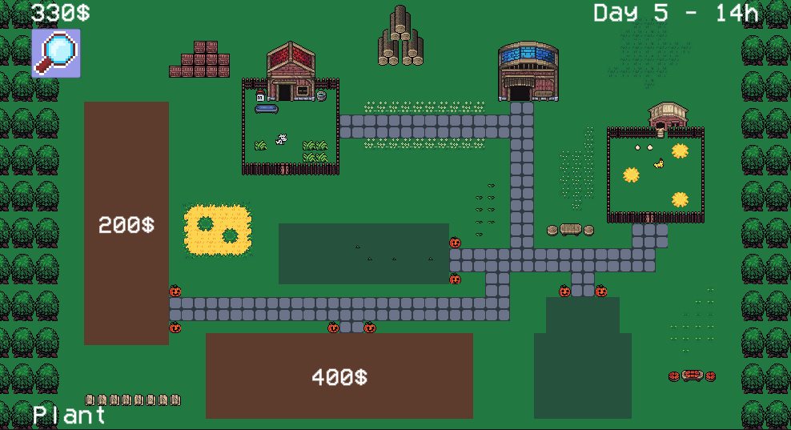

# FarmGame

## Gameplay

In FarmGame, you plant crops, and try to make a profit to buy more fields, and make your farm as big as possible !

## Mechanics

* To grow a seed, you need to first prepare the soil. After that, plant a crop. Then wait for the right time before harvesting it. Make sure to not let your crop rot !
* You have a list of tools on the menu on your right. With these you can prepare, plant, harvest, or delete a tile.
* If you want to buy a field, simply click on it. Be sure to have enough money !
* You can take a good look at your beautiful farm by clicking the magnifying glass icon.
* The game has a day & night cycle. During the day, you may notice some farm animals roaming around !

## How does it work

* The most important part is the crop system. At first, I wasn't sure how I should implement it. I then decided to go with Unity's Tilemap system. Although limited, it's enough for what I want to do here.
* I have a bunch of tilemaps. One for background, another for objects, then for planted crops, and finally one for available crop spaces (more on that in the next section).
* Once that was settled, the interesting mechanic is watching your fields grow. For that, I had 2 options : use a global coroutine that'll update each crop every game tick, or have a coroutine for each crop that'll only yield at the time the crop reaches next stage.
I went for the first approach : I'ld rather have a Coroutine that updates 10000 double every game tick than 10000 coroutines. In this game, one game tick represents an hour.

* The crops are plain ScriptableObjects containing informations like their stages, name, etc and are linked by reference to the CropTiles.

* For the fields, here is how it work :
1. Each field is represented by a cost and a tilemap. This tilemap represents all the space that will be available to the player once bought.
2. My GameManager script contains a cropsAvailableTilemap, which is checked whenever the player want to start interacting with a tile. If the cropsAvailableTilemap contains a tile at the same place, then the player can interact with this position.
3. When the player buys a field, it'll merge the cropsAvailableTilemap with the field's own tilemap to add the field's available spot.

I think this implementation is nice even for bigger tilemaps. Unity's Tilemap System has been heavily optimized over the years.

* Management-wise, I have all my managers (Game, Light, Sound, etc) on the same gameObject. I like keeping them all in one place to reduce "inspector-searching time". A lot of the configuration can be modified there.

* I have also implemented a simple animal roaming system, which works with the day/night cycle. I wanted to add some life in the project.

* For the UI I had to make sure it was working on all the possible resolutions on mobile. I've set the anchors and pivots carefully. I've tested the game on 3 different Android devices and it worked well.

* The Save & Load system is managed by the SaveManager script. I chosed to save the data as a json and not in the PlayerPrefs, because I think it's more reliable for larger data.
I save at every game tick and player action. It may sound like a lot, but it's the only way to make sure it correctly saves everything.
I added a Reset button for debug/test purposes that can be activated when pressed on it twice quickly.

* I used the experimental Light2D system, which worked great for this project. On night, the sun's intensity goes down while the farm's lights's power up.

## Ameliorations
* I tried to make sure the biggest pieces of code were carefully designed, but I'm sure some things can still be optimized. For example the crop's grow system. I thought about stocking all the planted crop's stages's game time in an array and making the coroutine wait until next stage evolution. It'ld ask for more calculations, but I think it would be better than updating each crop every gametick.
* I wanted to add a watering system but didn't have the time to. A crop would only take into account its time growing if it's been watered. If it hadn't been watered in the past 72 hours, it dies.
* Overall I had a lot of fun with this project, and I hope it'll show you what I can do.

## External Libraries Used
For this project, I used 2 external libraries :
* [DOTween](http://dotween.demigiant.com/index.php) is a Tweening Library I use in every project. More than just allowing animating via script, it can be used for timed events.
* [MessageKit](https://github.com/prime31/MessageKit) is a Library I discovered a few months ago and that I now use a lot. It works like the Observer pattern and is the main way my different scripts communicate between themselves.

## Credits 

* [All the sprites are from this wonderful free pack](https://sondanielson.itch.io/simple-farm-pack)
* [I got the music here](https://opengameart.org/content/casual-game-track)

